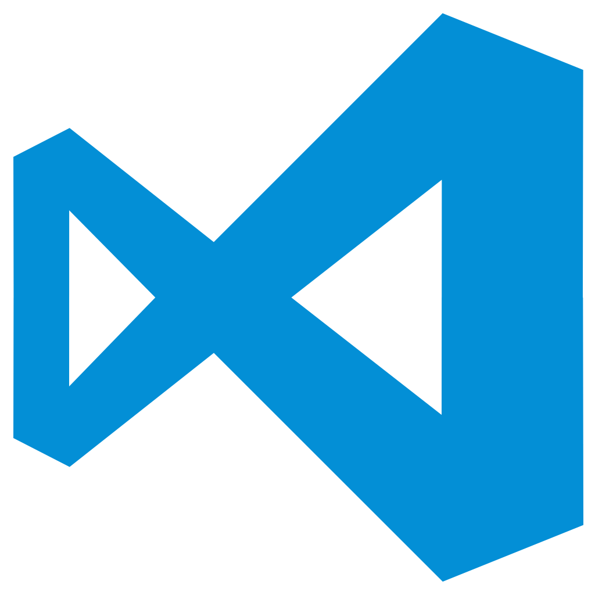

# Setting up VSCode
## Installing VSCode
  

1. Go to https://code.visualstudio.com/Download, and download the one appropriate for your OS
    1. **Windows**: Run the downloaded file (unzip if necessary)
    1. **Linux**: Decompress the file, using whatever tool you prefer, then install it.
    1. **Mac**: Unzip & Install the file

# Add VSCode Extensions

To download each of these extensions open VSCode & type `CTRL + Shift + X`
# Primary - Functionality Focused
 gitignore
---
Author: CodeZombie  
This is a coding highlighter that will provide syntax compatibility with files used in Git called .gitignore files. These can be VERY useful files if you are trying to keep sensitive files or information from being included in a push. 

 GitLens
---
Author: Eric Amodio
Gitlens is a useful live change tracking extension. When you have this installed and are working in a git repo locally, you can see individual line changes (additions, changes, removals). It also include Blame features, idetifies which commit hash a change belongs to, and allows for easy history comparison.

 Browser Preview
---
Author: Kenneth Auchenberg  
This allows you to bring up a virtual browser preview in VSCode to make WebDev projects easier.

 Docker
---
Author: Microsoft  
This makes it easy to create, manage, and debug containerized applications 

 Github Markdown Preview
---
Author: Matt Bierner  
This enables a live preview panel for monitoring markdown documents 

 GitHub Pull Requests and Issues
---
Author: GitHub  
A Pull Request and Issue Provider for GitHub. This is useful if you want to take your efforts in GitHub more seriously.

 XML 
---
Author: Red Hat  
This is a syntax highlighter for XML files

 YAML
---
Author: Red Hat  
This is a syntax highlighter for YAML/YML files

 PowerShell
---
Author: Microsoft  
Develop PowerShell modules, commands and scripts in Visual Studio Code. Mostly this is a Syntax highlighter for PowerShell code, but it has other features too. 

 Azure Account
---
Author: Microsoft  
This will be very useful when we get to the Cloud Computing chapters of this course. It will allow you to log in and manipulate your cloud environment from VSCode instead of having to login via your browser.

 Markdown Preview Mermaid Support
---
Author: Matt Bierner  
*Mermaid* is a markdown sublanguage. It can prove VERY useful for being able to describe and include logical flows in diagram form. For some examples check out [this](https://www.google.com) link

---
# Secondary - Functionality Focused
 docs-article-templates
---
Author: Microsoft  
I believe this one is built into VSCode, from what I can tell it isn't the best, but it is a good extension to add simply because its mantained by Microsoft

 docs-markdown
---
Author: Microsoft  
I believe this one is built into VSCode, from what I can tell it isn't the best, but it is a good extension to add simply because its mantained by Microsoft

 docs-preview
---
Author: Microsoft  
I believe this one is built into VSCode, from what I can tell it isn't the best, but it is a good extension to add simply because its mantained by Microsoft

 Hashicorp Terraform
---
Author: HashiCorp  
I HIGHLY recommend getting this one, it uses a special programming like language called Hashi Configuration Language (HCL) to describe different infrastructure as code, and can allow you to spin up and tear down entire cloud environments in minutes versus hours, with only a few simple commands. 

 Hashicorp Vault
---
Author: Owen Farrell  
This is a fantastic and relatively new toolset, we don't actually cover this during the course, but it can prove useful if you want to push your skills during the cloud computing block. Plus if you can go to your next interview and say you know how to setup and use Vault, any employer who actually understands cloud/devops technologies will definitely be impressed. 

 Hex Editor
---
Author: Microsoft  
You're unlikely to need this in this course, but for those of you who want to really challenge yourself, this can be an invaluable tool.

 HTML CSS Support
---
Author: ecmel  
CSS Intellisense for HTML.  
HTML id and class attribute completion for Visual Studio Code

 Markdown Checkboxes
---
Author: Matt Bierner  
This is a usful addition if you are interested in adding better progression representation to your documentation. 

  Markdown Emoji
---
Author: Matt Bierner  
This is a personal favorite of mine, it allows you to seriously step up your Markdown doc game, and bring a very personal and unique flavor to your documentation.

  Prettier - Code Formatter
---
Author: Prettier  
Extension Title: Prettier - Code Formatter  
A code formatter for JS, TypeScript, Flow, JSX, JSON, CSS, SCSS, Less, HTML, Vue, Angular, GraphQL, Markdown, & YAML.

 Start git-bash
---
Author: McCarter  
Adds a bash command to VSCode that allows you to start git-bash in the current workspace's root folder

 Learn VIM
---
Author: vintharas  
For anyone who is wanting to up their terminal text editor game, VIM is the way to go.   
NANO is great for getting started, but its less likely to be on any servers that you work with than VI/VIM is. Not to mention the great typing/editting speed ups you can get from mastering it.  
Be warned though, while learning VIM basics is easy, mastering it is a task that takes regular and repeated efforts. 

---

# Theme Focused
 Github Blue
---
Author: GitHub  
This is just my personal preference for VSCode Themeing, if you prefer something lighter or darker or something else entirely, just go search [here](https://marketplace.visualstudio.com)

 Github Theme
---
Author: GitHub  
GitHub theme for VS Code

